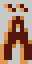
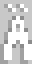
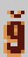

# Font Smasher - Author Guide

This document explains how to use this mod to edit and/or replace font glyphs
in Stardew Valley. For a complete real-world example, consult the sample pack
that came bundled with this mod.


## Contents

- [Introduction](#introduction)
- [Bold Fonts](#bold-fonts)
  - [Format](#format)
  - [Glyph Model Format](#glyph-model-format)
  - [Glyph Sub-Object Format](#glyph-sub-object-format)
  - [Example](#example)
- [Sprite Fonts](#sprite-fonts)
  - [Format](#format-1)
  - [Glyph Model Format](#glyph-model-format-1)
  - [Example](#example-1)
  - [Colors](#colors)
- [Caveats](#caveats)
  - [Upper and Lowercase Glyphs](#upper-and-lowercase-glyphs)
  - [Targeting Specific Languages](#targeting-specific-languages)
  - [Targeting Whitespace Glyphs](#targeting-whitespace-glyphs)
  - [Performance Notes](#performance-notes)
- [Potential Future Features](#potential-future-features)


## Introduction

Font Smasher works by providing data assets for other mods to edit. At this
time, clients are expected to be Content Patcher content packs; a C# / SMAPI
interface may follow later.

Generally, the way to add or edit glyphs is to target the assets for the fonts
you want to change, and provide data and/or textures for each glyph in each
one. Once you've done that, simply use the glyphs directly in your mod's
strings, as if they were there all along. Let's begin!


## Bold Fonts

The **bold fonts** are used by the game in dialogue boxes, mail, and titles or
section headings in some menus. They are the simplest to patch at this time,
because they are more restrictive. To edit them, target this asset:

`ichortower.FontSmasher/BoldFont`


### Format

<table>

<tr>
<th>Field</th>
<th>Type</th>
<th>Purpose</th>
</tr>

<tr>
<td><code>Glyphs</code></td>
<td>string&rarr;model dictionary</td>
<td>

The only field present in this font (this is for two reasons: one, to harmonize
with [the SpriteFont assets](#sprite-fonts), and two, to allow myself room to
add font-wide fields later on). The string key should be a single character
which is the unicode code point for this glyph, but see [Caveats](#caveats) for
more about unique JSON keys.

The model value follows the data format outlined below this one.

</td>
</tr>

</table>

### Glyph Model Format

All fields are optional.

<table>

<tr>
<th>Field</th>
<th>Type</th>
<th>Purpose</th>
</tr>

<tr>
<td><code>Dialogue</code></td>
<td>object</td>
<td>

An object with three optional fields (see below). This tells Font Smasher what
to do to represent this glyph in the plain dialogue-box version of the bold
font (i.e. `LooseSprites/font_bold`).

</td>
</tr>

<tr>
<td><code>Colored</code></td>
<td>object</td>
<td>

An object just like `Dialogue`, above, except this one controls the glyph used
for color-tinted bold text, like in mail and secret notes (i.e.
`LooseSprites/font_colored`).

</td>
</tr>
<tr>
<td><code>Junimo</code></td>
<td>object</td>
<td>

An object just like `Dialogue`, above, except this one controls the glyph used
for regular dialogue when `junimoText` is active.

</td>
</tr>
</tr>
<tr>
<td><code>LeftRightPadding</code></td>
<td>int</td>
<td>

How many pixels on both sides of the glyph's 8x16 texture are unused, and
should therefore be trimmed when rendering (default `0`). Due to limitations at
this time, the padding must apply to both sides, so the only valid character
widths are 8 (0), 6 (1), 4 (2), and 2 (3), and glyphs must be drawn centered in
their bounding boxes. In vanilla, most glyphs have 0 padding.

</td>
</tr>
</table>


### Glyph Sub-Object Format

<table>
<tr>
<td><code>Texture</code></td>
<td>string</td>
<td>

A game asset to draw this glyph's image from. You will need to Load any custom
texture you want to reference here. If this is omitted from a newly-added
glyph, it will use the default vanilla texture.

</td>
</tr>
<tr>
<td><code>SpriteIndex</code></td>
<td>int</td>
<td>

The index on the Texture to use. Glyphs in the bold font are 8 by 16 pixels.

This is technically optional, but the default value (unspecified) means to use
the glyph's Unicode code point minus 32 (or one of the slew of hardcoded other
offsets to make `font_bold` line up), which is probably not what you want.

</td>
</tr>
<tr>
<td><code>Baseline</code></td>
<td>int</td>
<td>

How high off the bottom of the 8x16 glyph sprite the font's baseline is, in
pixels. If omitted, this is `0` for uppercase letters and `3` for lowercase
ones.

The vanilla glyphs put the bottom row of shadow on the baseline, and the actual
glyph is one pixel above it.

</td>
</tr>
</table>


### Example

For example, let's add a glyph to the bold fonts: `Ȁ`.

```js
{
  "Target": "{{ModId}}/NewGlyphs, {{ModId}}/NewGlyphs_Colored",
  "Action": "Load",
  "FromFile": "assets/{{TargetWithoutPath}}.png"
},
{
  "Target": "ichortower.FontSmasher/BoldFont",
  "Action": "EditData",
  "TargetField": ["Glyphs"],
  "Entries": {
    "Ȁ": {
      "Dialogue": {
        "Texture": "{{ModId}}/NewGlyphs",
        "SpriteIndex": 0
      },
      "Colored": {
        "Texture": "{{ModId}}/NewGlyphs_Colored",
        "SpriteIndex": 0
      },
      "Junimo": {
        "SpriteIndex": 257
      }
    }
  }
}
```

Here, we've used two new textures, each with Ȁ at the top-left, for the
Dialogue and Colored glyphs. Perhaps they look like this:




For junimo text we've given the index of the junimo A in the `font_bold` sheet,
since in vanilla all diacritic-marked junimo letters are identical to the
unmarked ones.

Alternately, let's edit the glyph `ğ`. As it is already present in `font_bold`,
we can edit the image assets and just give the data we need:

```js
{
  "Target": "LooseSprites/font_bold",
  "Action": "EditImage",
  "FromFile": "assets/g-breve.png"
  "ToArea": {
    "X": 56, "Y": 96, "Width": 8, "Height": 16
  }
},
{
  "Target": "LooseSprites/font_colored",
  "Action": "EditImage",
  "FromFile": "assets/g-breve-colored.png"
  "ToArea": {
    "X": 56, "Y": 96, "Width": 8, "Height": 16
  }
},
{
  "Target": "ichortower.FontSmasher/BoldFont",
  "Action": "EditData",
  "TargetField": ["Glyphs"],
  "Entries": {
    "ğ": {
      "Junimo": {
        "SpriteIndex": 263
      },
      "LeftRightPadding": 1
    }
  }
}
```

In this example, we've used a ğ glyph that is only 6 pixels wide:



... so we tell Font Smasher to trim the whitespace when rendering. We also use
the index for `g`'s junimo glyph, so ğ will be visible if we display any junimo
text.


## Sprite Fonts

The **sprite fonts** are used by the game in most user interface items:
inventory, hover tooltips, most menu labels, etc. There are actually three of
them, and each has its own asset to target in FontSmasher:

1. SpriteFont1, the bigger font (usually 3x, but 2x for German and Russian).\
   Use `ichortower.FontSmasher/SpriteFont1`.
2. SmallFont, the smaller font (2x). Identical to SpriteFont1, just smaller. \
   Use `ichortower.FontSmasher/SmallFont`.
3. tinyFont, which is, as far as I know, only used for item quantities in your
   inventory. \
   Use `ichortower.FontSmasher/TinyFont`.


### Format

Fortunately, all three assets use the same format:

<table>

<tr>
<th>Field</th>
<th>Type</th>
<th>Purpose</th>
</tr>

<tr>
<td><code>Metrics</code></td>
<td>object</td>
<td>

This object has three fields, all integers. They are font-wide values and
should generally be avoided unless you are replacing most or all glyphs in the
font, and even then, you should avoid the first two unless you are resizing the
font.

`Baseline`: Where the baseline in the font is, measured in pixels counting down
from the top of the line. This isn't part of the font data proper, but it is
used to calculate bounding boxes when adding or editing glyphs. It will be
measured from the pre-patch font asset if not specified.

`LineSpacing`: How tall each line of text is. Used when breaking lines, to move
the draw position.

`ScaleNewSources`: An integer percentage to use to scale all glyph-specific
metrics by default. Any glyphs that specify their own `ScaleMetrics` value will
use that instead (and see the description of that property for how the scaling
works). The point of this value is to make it easier to (for example) patch the
entirety of SpriteFont1 at 3x, then use the same data and source texture to
patch the entirety of SmallFont at 2x.

</td>
</tr>

<tr>
<td><code>Glyphs</code></td>
<td>string&rarr;model dictionary</td>
<td>

Just like the Glyphs field used in the Bold fonts, above, keys should typically
be single unicode characters.

The model value format is outlined below. It differs substantially from the one
used in BoldFont.

</td>
</tr>
</table>


### Glyph Model Format

All fields are optional, although some of them become mandatory in specific
circumstances: see the descriptions for details.

In general, if a value is not provided, it will be left unchanged when
modifying an existing glyph. For new glyphs, Font Smasher tries to use a sane
default.

<table>

<tr>
<th>Field</th>
<th>Type</th>
<th>Purpose</th>
</tr>

<tr>
<td><code>Texture</code></td>
<td>string</td>
<td>

A game asset to draw this glyph's image from. You will need to Load any custom
texture you want to reference here. If this is omitted from a newly-added
glyph, it will use the existing SpriteFont texture, although this is unlikely
to be useful, so in practice this field is all but mandatory.

</td>
</tr>

<tr>
<td><code>ScaleMetrics</code></td>
<td>int</td>
<td>

An integer percentage to use to scale all of the metrics for this glyph (this
will apply to every field listed hereafter in this table). For example,
specifying `200` here will multiply all values by 2, `300` by 3, etc. For best
results, it is recommended to use multiples of 100 (or, e.g., `50`, to scale a
glyph *down*), to get clean integer scaling.

This is intended to let you design your font texture at 1x scale, then provide
it to FontSmasher and have it scale it up to 2x or 3x for you. This is how the
sample pack operates: its source texture is at 1x, but is rendered at higher
scales when added to the fonts' atlases.

When using this field, specify all other glyph metrics *as they are in the
source texture*. If your texture is at 1x and the glyph you are adding is at
(120, 100, 5, 8) in it, specify that SourceRect exactly. Likewise, give your
values to AboveBaseline, LeftSideBearing, etc. in terms of pixels *in the source
texture*. The scaling will handle converting them to the final, correct size.

</td>
</tr>

<tr>
<td><code>SourceRect</code></td>
<td>Rectangle</td>
<td>

A Rectangle (object with `X`, `Y`, `Width`, `Height` fields) specifying the
area on the source texture which contains the glyph. *This rectangle should be
as small as possible to fully contain the glyph*; do not include any padding or
spacing (there are other fields for that information).

If you are adding a new glyph to a font, this field is mandatory. If the glyph
already exists, it is optional (there is no need to change a source rect).

</td>
</tr>

<tr>
<td><code>Padding</code></td>
<td>object</td>
<td>

This object is like a Rectangle, but its four integer fields are called `Left`,
`Right`, `Top`, and `Bottom`. It should be measured in source texture pixels.
It defines the amount of empty space which should surround the active glyph
area (the SourceRect), in order to position it correctly in the line of text.

This field is optional, and in most cases it is not recommended to specify it
at all, since AboveBaseline and BelowBaseline handle vertical positioning, and
LeftSideBearing and RightSideBearing are mostly indistinguishable from Left and
Right padding. But if you wish to specify any part of it, you can just list the
parts you want and omit the others.

(the Left and Right padding values are considered part of the glyph, and so are
always rendered, while the LeftSideBearing is omitted if this glyph is the first
on its line of text. The difference is nearly imperceptible, and generally the
bearing behavior is the more desirable)

</td>
</tr>

<tr>
<td><code>AboveBaseline</code></td>
<td>int</td>
<td>

The number of pixels **above** the font's baseline that this glyph sits. Recall
that the font's baseline is either specified in the font-wide `Metrics` or
calculated from the existing font data: in general, new glyphs will be assumed
to sit on the baseline unless told otherwise by this value (or by its twin,
`BelowBaseline`).

Specify only one of this or `BelowBaseline` (this one will take precedence if
both are given). Use this one for things that sit high, like `"` and `-`.

</td>
</tr>

<tr>
<td><code>BelowBaseline</code></td>
<td>int</td>
<td>

The number of pixels **below** the font's baseline that this glyph sits. The
mutually-exclusive counterpart to `AboveBaseline`.

Specify only one of this or `AboveBaseline` (that one will take precedence if
both are given). Use this one for things that hang below, like `g` and `p`.

</td>
</tr>

<tr>
<td><code>LeftSideBearing</code></td>
<td>float</td>
<td>

An amount of whitespace, measured in pixels, to place before this glyph (to the
left), when following another character (i.e. when not the first glyph in a
line of text).

Will default to `1.0` if unspecified for a new glyph.

</td>
</tr>

<tr>
<td><code>RightSideBearing</code></td>
<td>float</td>
<td>

An amount of whitespace, measured in pixels, to place after this glyph (to the
right).

Will default to `1.0` if unspecified for a new glyph.

</td>
</tr>

</table>


### Example

For example, let's add the same glyphs from the earlier bold examples (`Ȁ` and
`ğ`) to the sprite fonts. Here's the putative texture this example uses
(rendered here at 4x), with the SourceRects drawn in and labeled:


```json
{
  "Target": "{{ModId}}/Example",
  "Action": "Load",
  "FromFile": "assets/{{TargetWithoutPath}}.png"
},
{
  "Target": "ichortower.FontSmasher/SpriteFont1",
  "Action": "EditData",
  "TargetField": ["Glyphs"],
  "Entries": {
    "Ȁ": {
      "Texture": "{{ModId}}/Example",
      "ScaleMetrics": 300,
      "SourceRect": {
        "X": 0, "Y": 0, "Width": 6, "Height": 13
      }
    },
    "ğ": {
      "Texture": "{{ModId}}/Example",
      "ScaleMetrics": 300,
      "SourceRect": {
        "X": 8, "Y": 4, "Width": 6, "Height": 12
      },
      "BelowBaseline": 3,
      "RightSideBearing": 0.0
    }
  }
},
{
  "Target": "ichortower.FontSmasher/SmallFont",
  "Action": "EditData",
  "TargetField": ["Glyphs"],
  "Entries": {
    "Ȁ": {
      "Texture": "{{ModId}}/Example",
      "ScaleMetrics": 200,
      "SourceRect": {
        "X": 0, "Y": 0, "Width": 6, "Height": 13
      }
    },
    "ğ": {
      "Texture": "{{ModId}}/Example",
      "ScaleMetrics": 200,
      "SourceRect": {
        "X": 8, "Y": 4, "Width": 6, "Height": 12
      },
      "BelowBaseline": 3,
      "RightSideBearing": 0.0
    }
  }
}
```

In this example, all we need to do for Ȁ is to give its SourceRect and
ScaleMetrics: it sits on the baseline, and the default bearings are fine. For
ğ, it hangs below the baseline by 3 pixels, and because its lower loop juts out
to the right, it will generally look nicer with less space on that side, so we
set the RightSideBearing to zero.

Note that you are under no obligation to arrange your glyphs in a particular
way when providing a texture for patches to the sprite fonts. Any arrangement
is valid as long as your SourceRects are correct, although I find it helpful to
order them and line them up with each other.

Unfortunately, patching both fonts separately means we have to copy-paste the
patch and change the scaling number. However, Content Patcher has a great
solution for this problem in [Local
Tokens](https://github.com/Pathoschild/StardewMods/blob/develop/ContentPatcher/docs/author-guide/tokens.md#local-tokens);
or if you wish to use different data and thus have two different fonts for
SpriteFont1 and SmallFont, that option is available to you.


### Colors

When editing the bold font, you have full control over the text color, since the
texture is used as-is and the shadows are baked in. But SpriteFonts are
monochrome white (for tinting purposes) and don't include shadows (they are
generated live). So how do you control what colors the game uses to draw them?

Normally, you don't: The sprite fonts use a selection of hardcoded colors
when drawing, and there's no facility available to override them. Enter Font
Smasher! To change the colors the game uses when rendering the SpriteFonts,
edit this asset:

`ichortower.FontSmasher/SpriteFontColors`

The asset is a string&rarr;string dictionary, where the keys are targets and the
values are string representations of colors to use.

**Warning!**: Due to infelicities in how the sprite font colors are handled by
the game, these color settings are *global* and are shared between SpriteFont1
and SmallFont.

Here are the supported targets you can use as keys:

<table>
<tr>
<td><code>Text</code></td>
<td>

The default text color. The value given here will override `Game1.textColor`.

</td>
</tr>

<tr>
<td><code>Shadow</code></td>
<td>

Together with DarkShadow, this is one of the default shadow colors used to
render SpriteFonts in most situations in the game. This value overrides
`Game1.textShadowColor`.

</td>
</tr>

<tr>
<td><code>DarkShadow</code></td>
<td>

Together with Shadow, this is one of the default shadow colors used to render
SpriteFonts in most situations in the game. This value overrides
`Game1.textShadowDarkerColor`.

</td>
</tr>

<tr>
<td><code>Unselected</code></td>
<td>

A rarely-used alternate text color (`Game1.unselectedOptionColor`). Vanilla
uses it in quest objectives and in one kind of dialogue box that I'm not fully
sure when it appears.

Notably, Generic Mod Config Menu uses this as the hover color for mod names in
the main list menu, so keep in mind that your users will likely see it there.

</td>
</tr>

<tr>
<td><code>Category_&lt;category id&gt;</code></td>
<td>

This key allows you to target a [category of
item](https://stardewvalleywiki.com/Modding:Items#Categories), by using a
category's (negative) id in the key. For example, to target the "Animal
Product" category (-5), you would use the key `Category_-5`.

When rendering the tooltip description for an item, the game normally uses a
hardcoded color to draw the category name in place of `Game1.textColor` (in
the wiki link above, the hardcoded color is listed in the table). Specifying
these keys allows you to override those colors with your own choices.

</td>
</tr>
</table>

And here are the supported formats you can use when specifying a color:

<table>
<tr>
<td><code>#rrggbb</code></td>
<td>

A six-digit hexadecimal representation of the color, using 2 digits (8 bits)
for each of red, green, and blue, in that order (example: `#a088b2`).
Not case-sensitive.

Each value ranges from `00` (0) to `ff` (255).

</td>
</tr>

<tr>
<td><code>#rrggbbaa</code></td>
<td>

An eight-digit hexadecimal representation of the color, using 2 digits (8 bits)
for each of red, green, blue, and alpha, in that order (example: `#ccb2a980`).
Identical to the above format, but also specifies an alpha channel value.

Alpha value ranges from `00` (0, fully transparent) to `ff` (255, fully opaque).

</td>
</tr>

<tr>
<td><code>rgb(r, g, b)</code></td>
<td>

A more human-oriented version of the hexadecimal color representation. Give
three integers inside the parentheses, each from 0 to 255: red, green, and
blue, in that order (example: `rgb(160, 136, 178)`). Not case-sensitive.

Values will be clamped to fit within the expected range.

</td>
</tr>

<tr>
<td><code>rgba(r, g, b, a)</code></td>
<td>

Identical to the above format, but also specifies an alpha channel value
(which should also range from 0 (fully transparent) to 255 (fully opaque)).

The `a` in the opening `rgba(` is optional.

</td>
</tr>

<tr>
<td><code>@&lt;ColorName&gt;</code></td>
<td>

Used to name a color, without having to specify its values directly (example:
`@White`). The color name must match one of the static properties defined in
MonoGame's `Color` class ([see here for a list](color-table.md)).

</td>
</tr>
</table>

Note that although you can specify translucent colors using the alpha value, I
do not generally recommend doing this, due to the way the game draws text
using the SpriteFonts. First, the game draws the text three times at small
offsets, using the appropriate shadow color (so a translucent shadow will be
rendered with overlaps at different resulting opacities), and then it draws
one more time in the text color (so if that color is translucent, the shadows
will be visible through it).


## Caveats

### Upper and Lowercase Glyphs

When patching the font types, the keys for your Entries or Fields patches are
generally expected to be single characters. Unfortunately, it is a shortcoming
(for this use case) of Newtonsoft JSON and how it is employed by Content
Patcher that keys are case-insensitive. This means that if you attempt to edit,
say, `D` and `d` in the same patch, the entries will be collapsed into one.
There is no fear of colliding in the target data model itself, since
FontSmasher and the base game SpriteFonts both use a conventional C# Dictionary
in which the keys are case-sensitive, but this means that at parse time, you
cannot provide both uppercase and lowercase versions of the same glyph in the
same patch without a workaround.

The recommended approach is simply to use a second patch for one case of
letters: for example, you could patch the uppercase letters and symbols and so
on in one patch, and move the edits to the lowercase letters to another patch.

The second potential workaround is to change the keys of one case of letters by
appending some arbitrary suffix to the keys. For example, after patching the
uppercase F with the plain key, you could use the key `"f small"` to target the
lowercase f without colliding. This works because Font Smasher deliberately
discards everything after the first character in the key when deciding which
glyph to target, but providing the extra (discarded) information makes the key
unique and prevents Newtonsoft from collapsing them. This has the advantage of
letting you put all your glyphs in the same patch, but it might cause
unexpected behavior if multiple mods edit the same glyph with different
suffixes: the edits will end up applying in dictionary iteration order instead
of patch priority/load order.

There are examples of both approaches in the sample content pack.


### Targeting Specific Languages

Chinese, Japanese, and Korean fonts are only somewhat supported and typically
won't look good with the same font patches as the Latin- and Cyrillic-using
languages. In addition, of the latter group, Russian and German use a different
scale for SpriteFont1 than the others (200 instead of 300). For these (and
maybe other) reasons, you may wish to target only some languages with a given
patch.

To do this, use Content Patcher's `Language` token. For example, to patch only
when German or Russian is the current language:

```json
"When": {
  "Language": "de, ru"
}
```

This token will refresh whenever the game language is changed, and Font Smasher
is set up to reload its data assets in that event as well, so this should
suffice to patch only the desired languages.


### Targeting Whitespace Glyphs

Due to another limitation in Content Patcher, keys are trimmed of whitespace,
which makes using any whitespace glyph an issue: either it will be deleted
entirely, or (if given a suffix) the suffix will end up becoming the key after
the whitespace is "helpfully" trimmed.

To circumvent this, the space character (U+0020, ' ') is targeted by using the
special key `"<Space>"`. Likewise, the non-breaking space (U+00a0, ' ') is
targeted with the key `"<Nbsp>"`. No other whitespace characters are currently
supported, but as far as I know, only the regular space is ever used or even
functional in the game.


### Performance Notes

Patching the bold fonts is fairly performant, but doing edits to the sprite
fonts imposes a noticeable one-time cost, because of my approach to render the
needed glyphs directly into the texture and edit the data structures in-place
(chosen due to the SpriteFont class's irritating assumptions and hostility to
edits). Thankfully, once the cost is paid, it no longer matters and the font is
fully performant in use.

Because of the noticeable lag when a font is first needed, Font Smasher
deliberately requests its font data assets as soon as Content Patcher comes
online (shortly after GameLaunched). This doesn't prevent the lag, but it moves
it to a time when the user can't interact with the game, so it's less obvious.
If the assets later need to be reloaded (for example, when switching game
languages, or when a configurable font pack changes some of its patch
instructions), the cost will need to be paid again, but I expect that in
standard use, a given user will set up their configs and then not fiddle much
with them, so it shouldn't be a big deal.


## Potential Future Features

No promises. This is a wishlist.

- Ligatures
- Kerning
- Asymmetric trimming in bold font
- Performance improvements
